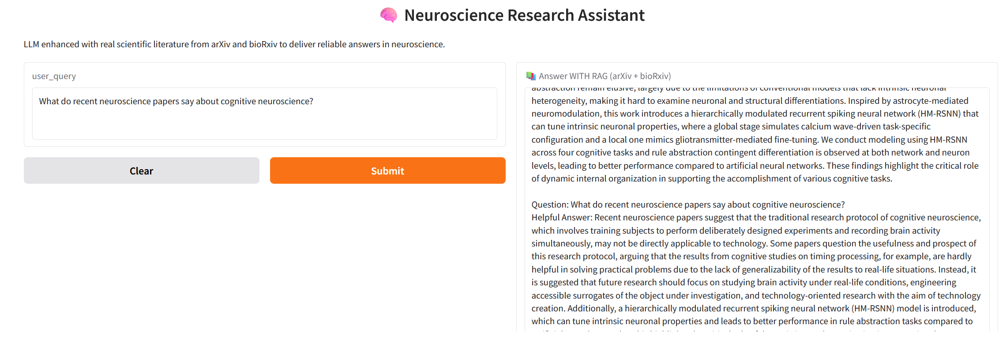

<div align="center">
  
</div>

# Neuroscience Research Assistant: Retrieval-Augmented Generation with Large Language Models

This project presents the development and deployment of an AI-powered research assistant for neuroscience and neuroengineering. By integrating retrieval-augmented generation (RAG) techniques with a large language model, the complete notebook demonstrates an end-to-end pipeline for real-world scientific literature search and question answering. The workflow begins with retrieving and preprocessing the latest research abstracts from arXiv and bioRxiv, continues through embedding and semantic indexing, and culminates in interactive, literature-grounded Q\&A via a web interface. The goal is to make complex neuroscience research more accessible, actionable, and up-to-date for students, researchers, and clinicians.

## Overview

Staying current with neuroscience research is increasingly challenging due to the vast volume of new publications and the diversity of topics within the field. This project addresses that challenge by designing a system that automatically gathers, processes, and indexes recent neuroscience literature from trusted open-access repositories. It then leverages a large language model to answer user questions, grounding its responses in the most relevant and recent scientific documents. The solution must overcome practical challenges such as parsing noisy real-world data, efficiently embedding large collections of text, and maintaining the interpretability and reliability of AI-generated answers.

## Getting Started

To run this project on your own machine, start by cloning or downloading the repository. Ensure that Python 3.10 or a compatible Python 3.x version is installed, then install all necessary dependencies using the provided requirements.txt file with the command

```bash
pip install -r requirements.txt
```

For optimal performance, it is strongly recommended to use a runtime with an NVIDIA T4 GPU or better when running the notebook in Google Colab or a similar environment, especially when loading large language models like Mistral-7B. On such hardware, a complete answer to a user query is usually generated in about 20 seconds.

Once your environment is set up, open the [notebook file](rag_llm_neuroscience.ipynb) in Jupyter Notebook, JupyterLab, or upload it to Google Colab for a cloud-based workflow. Run each notebook cell in order to walk through the full data pipeline, from literature retrieval and cleaning, through embedding and indexing, to loading the language model and launching the interactive web app.

## Dataset

The literature corpus for this project is sourced from arXiv and bioRxiv, which are leading open-access platforms for sharing preprints in neuroscience and related disciplines. The system queries these databases with a set of key neuroscience and neuroengineering topics, downloading recent abstracts to create a living dataset that reflects the latest advances in the field. Each abstract is treated as a primary source for grounding model responses, ensuring that answers are both accurate and up-to-date.

## Project Workflow

The workflow begins by defining a comprehensive list of neuroscience-related topics to guide the search for relevant literature. For each topic, abstracts are fetched from arXiv and bioRxiv using their respective APIs. The raw text is then cleaned and standardized to remove formatting inconsistencies and extraneous characters. Each abstract is split into overlapping text chunks to improve retrieval precision and context coverage.

These text chunks are then embedded into a high-dimensional vector space using Hugging Face embedding models, and stored in a Chroma vector database. This setup enables efficient semantic search across the collection. When a user submits a neuroscience question, the system retrieves the most relevant chunks using vector similarity, and passes them, along with the query, to a large language model. The language model, configured with 4-bit quantization for memory efficiency, generates an answer grounded in the retrieved literature. The final step is the deployment of a Gradio web interface, allowing users to interactively pose questions and receive answers supported by the latest scientific research.

## Key Features & Techniques

This project combines automated literature retrieval, advanced text preprocessing, and semantic search with a large language model to create a robust, research-focused question answering tool. Comprehensive data cleaning and chunking ensure high-quality input for embedding and retrieval. The use of 4-bit quantized LLMs provides efficient inference on standard GPUs. The entire workflow is designed to be transparent, reproducible, and easy to adapt to new topics or data sources, with all steps and parameters clearly documented in the code.

## Results

Evaluation of the system shows that retrieval-augmented generation consistently produces answers that are not only accurate but also grounded in the latest neuroscience research. The model is able to synthesize information from multiple recent papers, providing responses that reflect both domain expertise and current scientific consensus. Direct comparison between RAG-generated answers and those produced by the language model alone highlights the value of document retrieval in improving answer quality and timeliness. The Gradio interface allows for real-time user interaction and demonstrates the practical potential of RAG-based AI for research support.



## Contact

For questions, feedback, or collaboration opportunities, please reach out via [LinkedIn](https://www.linkedin.com/in/hami-hekmati-399932154/)
 or by opening an issue in this repository. This project was developed by Hami Hekmati as part of a portfolio in data science, natural language processing, and AI for scientific discovery.
